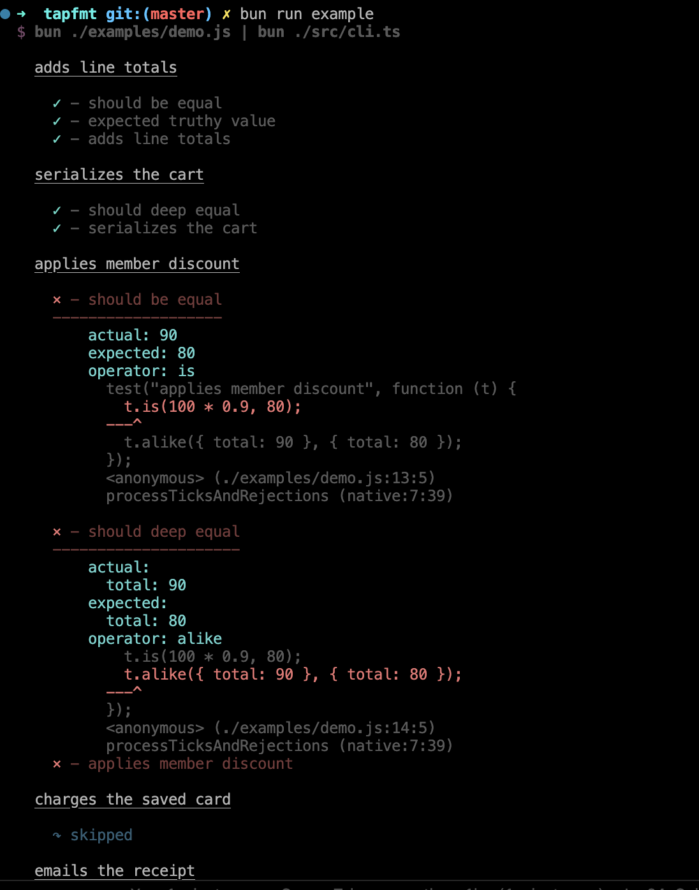

# tapfmt

Pretty-print [TAP](https://testanything.org) (v13) as spec output or JSON.

## Install

```bash
bun add tapcolorize-formatter
```

CLI:

```bash
bun add -g tapcolorize-formatter
```

or `bunx tap-colorize`.

## Example

This repo uses [brittle](https://github.com/holepunchto/brittle) as the TAP producer and formats it with `tapfmt`:

```bash
bun examples/demo.js | bunx tap-colorize
```

Same thing via scripts:

```bash
bun run example
bun run test:fmt
```

`examples/demo.js` covers pass, fail, skip, and todo. A saved TAP stream works the same:

```bash
cat test/fixtures/example.txt | bunx tap-colorize
```



## Formats

- `spec` (default)
- `json`

```bash
cat results.tap | tap-colorize -f json
```

## Library

```ts
import { parse, SpecFormatter, JsonFormatter } from "tapcolorize-formatter";

const results = parse(`TAP version 13
1..2
ok 1 test 1
not ok 2 test 2
`);

const spec = new SpecFormatter();
console.log(spec.formatToString(results));
console.log(spec.summaryToString());

const json = new JsonFormatter();
console.log(JSON.stringify(json.toJson(results), null, 2));
```

## Why

TAP is a cross-language protocol. Formatters usually are not — they ship tied to one runtime. `tapfmt` is a CLI and a TypeScript library you can pipe any TAP stream into.

```bash
bun examples/demo.js | tapfmt
bun run test | tapfmt
cat results.tap | tapfmt
```

## License

MIT
